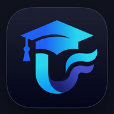

<div align="center">

  

  # UniStream22

  <p><strong>A Next-Generation Academic Portal & Real-Time Student Operating Hub</strong></p>
  <p>Engineered for 4th-Year Computer Science Students • Higher Technological Institute (HTI) • Class of 2026 / Batch 22</p>

  <div>
    
    
    
    
    
    
    
  </div>

  <br />

  <p>
    <a href="https://unistream22.vercel.app"><strong>🌐 Explore the Live Platform »</strong></a>
  </p>

</div>

---

## 💡 The Product Idea & Vision

### 🧩 1. The Real-World Academic Challenge
In higher education environments—particularly in intensive technical faculties like Computer Science—information distribution is notoriously broken and inefficient:

- **The "Chat Noise" Chaos**: Crucial departmental instructions, assignment deadline modifications, and lecture venue shifts are routinely scattered across dozens of unstructured WhatsApp groups, Telegram channels, and social media posts. Important announcements from professors and teaching assistants get buried under hundreds of student messages.
- **The "Schedule Fragmentation" Dilemma**: Senior-year students attend specialized technical courses (*Digital Image Processing*, *Cloud Computing*, *Data Mining*, *Data Communications*, and *Graduation Project 1*). Because laboratory and practical sections are divided into multiple distinct groups (Groups 1 through 6), students are traditionally forced to decipher massive, multi-page departmental spreadsheets daily just to figure out when and where their next class takes place.
- **The "Campus Connectivity" Barrier**: University lecture halls, computer labs, and basement auditoriums frequently suffer from poor or non-existent cellular reception. Online-only student portals fail completely when students need them most—right before entering an exam or lecture hall.

---

### 🎯 2. The Solution: "UniStream"
The name **UniStream22** encapsulates the core mission of the platform:

> **Uni** *(University & Unity)* &nbsp;+&nbsp; **Stream** *(Continuous Academic Flow)* &nbsp;+&nbsp; **22** *(Batch 22 / Senior Class)*

Rather than acting as a static, bureaucratic university website, **UniStream22 re-engineers student life as a calm, personal, and centralized digital stream**:

1. **One Authoritative Source of Truth**: All official departmental circulars, faculty instructions, and lab announcements are published directly to a unified, chronologically organized timeline.
2. **Adaptive Personal Timetables**: Students select their specific laboratory groups once (`/selectschedule`). The timetable engine automatically filters out extraneous sections, rendering a clear, personalized weekly agenda with room numbers and live day indicators.
3. **The Two-Second Benchmark**: Every user interface flow is engineered to answer a student's immediate question within two seconds: *What lecture do I have next, in which hall, and is there any urgent notice for this week?*

---

### 🏛️ 3. Core Product Pillars

| Pillar | Philosophy | Implementation |
|---|---|---|
| **Zero-Distraction UI** | Focus, clarity, and calm academic productivity. | No advertisements, no social vanity metrics, and no sluggish decorative animations. Clean cards, high information density, and rapid navigation. |
| **Contextual Personalization** | Relevant only to the individual student. | Dynamic schedule engine that maps each student's chosen practical groups to their personalized timetable. |
| **Offline-First Resilience** | Uninterrupted access on campus. | Built as a Progressive Web App (PWA) with intelligent service worker caching—schedules and notes remain accessible with zero network signal. |
| **Bilingual First-Class Citizen** | Native Arabic & English parity. | Automated bidirectional layout switching (`dir="rtl"` and `dir="ltr"`) featuring **IBM Plex Sans Arabic** for technical Arabic typography and **Plus Jakarta Sans** for Latin geometry. |

---

## ✨ Key Feature Highlights

### 📢 1. Centralized Announcement Stream (`/home`)
- **Chronological Week Feed**: Faculty announcements grouped by academic week, keeping historical context organized and searchable.
- **Priority Categorization**: Color-coded badges for **Urgent & High Priority**, **Medium**, and **General Notices** with live pulse indicators.
- **Instant Search & Category Tabs**: Real-time filtering by course title, section group, or keyword, with quick filter tabs (`All`, `Urgent`, `Regular`).
- **Shimmer Skeletons**: Smooth skeleton loading placeholders that prevent layout shifts while fetching live updates.

### 🗓️ 2. Adaptive Weekly Timetable (`/schedule`)
- **Group-Aware Scheduling**: Dynamically renders lecture and lab timings based on each student's enrolled section groups.
- **Interactive Day Tabs**: Tabbed weekday navigation (`Saturday` through `Friday`) with a live pulsing indicator highlighting **Today**.
- **Contextual Badges**: Chips for lecture start/end timings (`09:00 - 10:40`), campus room numbers, and course codes.

### ⚙️ 3. Interactive Group Selection Engine (`/selectschedule`)
- **Visual Group Selector**: Interactive pill selectors (`Group 1` to `Group 6` or `None`) replacing traditional dropdowns for frictionless setup.
- **Confirmation Dialog**: Accessible modal dialog verifying schedule changes before saving to the cloud.

### 📝 4. Student Study Notepad (`/notes`)
- **In-Browser Scratchpad**: Fast scratchpad for course notes, lecture reminders, and study checklists.
- **Color-Coded Palettes**: Visual organization across Amber, Sky, Emerald, Purple, and Rose themes.
- **Smart Management**: Pin-to-top feature, live character counter, delete confirmation dialogs, and instant local storage backup with Supabase cloud sync.

### 📱 5. Progressive Web App (PWA)
- **Installable Native Experience**: Add to home screen on iOS, Android, macOS, and Windows.
- **Custom Service Worker**: Built with Workbox caching strategies ensuring offline reliability in campus dead zones.

### 🛡️ 6. Faculty Administration Portal (`/dashboard/addnews`)
- **Secure Access Control**: Role-based authentication verifying student vs. administrator privileges.
- **Announcement Publisher**: Dedicated drafting portal to compose, tag by subject, set priority, and broadcast notices to the batch.

---

## 🛠️ Technologies Used

### 🖥️ Frontend & Architecture
- **[Next.js 16.1](https://nextjs.org/) (App Router)**: The React framework for production, leveraging React Server Components, server actions, route handlers, and Webpack compilation.
- **[React 19.2](https://react.dev/)**: The core rendering engine delivering concurrent transitions, optimized hydration, and reactive state updates.
- **[TypeScript 5](https://www.typescriptlang.org/)**: Full-stack end-to-end type safety guaranteeing robust data modeling and zero runtime interface errors.

### 🎨 Design System & UI Components
- **[Tailwind CSS v4](https://tailwindcss.com/)**: Next-generation utility-first styling engine utilizing native CSS `@theme inline` variables, high-performance compilation, and clean cascading layers.
- **[Radix UI Primitives](https://www.radix-ui.com/) (Shadcn UI Architecture)**: Unstyled, fully accessible UI foundations adapted for UniStream22:
  - **Tabs**: Segmented controllers for schedule days and feed filtering.
  - **Dialog**: Accessible modal dialogs with backdrop blur and focus trapping.
  - **DropdownMenu**: User profile, quick navigation, and session actions.
  - **Avatar**: Visual student and subject initials chips.
  - **Badge**: Multi-variant priority and metadata indicators (`destructive`, `success`, `accent`, `secondary`).
  - **Tooltip**: Action hints and keyboard shortcut indicators.
  - **Skeleton**: Content-aware shimmer placeholders.
  - **Separator**: Semantic dividers maintaining visual hierarchy.
- **[Lucide React](https://lucide.dev/)**: Clean, consistent vector iconography.

### 🔤 Typography & Internationalization
- **[IBM Plex Sans Arabic](https://fonts.google.com/specimen/IBM+Plex+Sans+Arabic)**: The premier technical Arabic digital typeface, offering clean vertical alignment, balanced counter-spaces, and protected cursive ligatures.
- **[Plus Jakarta Sans](https://fonts.google.com/specimen/Plus+Jakarta+Sans)**: Modern geometric grotesque typeface optimized for tabular numerals, course codes, and dashboard readability.
- **Bi-Directional Engine**: Custom React Language Context dynamically switching text direction (`dir="rtl"` vs. `dir="ltr"`), document language tags, and localized date formatting.

### 🗄️ Backend, Database & Authentication
- **[Supabase](https://supabase.com/)**: Cloud database backend hosting PostgreSQL tables for announcements, student profiles, group schedules, and sticky notes via REST APIs.
- **Next.js Route Handlers (`/api/*`)**: Serverless API endpoints managing authentication token verification, schedule queries, and note synchronization.
- **JWT & Role-Based Middleware**: Next.js Edge Middleware verifying student session cookies and enforcing role-based route protection (`admin` vs. `student`).

### ⚡ Offline & Mobile Capabilities
- **`next-pwa` & Google Workbox**: Pre-caching static runtime assets, fonts, and application shell routes.
- **Web App Manifest (`manifest.json`)**: Configured with custom high-resolution maskable app icons, theme colors, and standalone display modes.

---

## 📁 Architectural Overview

```text
uniStream22/
├── public/                     # Static assets, PWA icons, manifest, service worker
│   ├── icons/                  # High-res PWA icons (192x192, 512x512, apple-touch)
│   ├── favicon.ico             # Multi-layer favicon
│   ├── manifest.json           # Web App Manifest
│   └── sw.js                   # Workbox service worker
├── src/
│   ├── app/                    # Next.js App Router routes
│   │   ├── (auth)/             # Login & Signup pages
│   │   ├── api/                # Backend API route handlers (Supabase integration)
│   │   ├── dashboard/          # Admin announcements publisher
│   │   ├── home/               # Student announcements stream
│   │   ├── new/[id]/           # Individual announcement article view
│   │   ├── notes/              # Sticky notes scratchpad
│   │   ├── schedule/           # Weekly schedule viewer
│   │   ├── selectschedule/     # Course group selector
│   │   ├── layout.tsx          # Root layout with font variable bindings & providers
│   │   ├── page.tsx            # Product landing page & feature showcase
│   │   └── globals.css         # Tailwind v4 theme tokens & direction-aware typography
│   ├── components/             # Reusable UI components
│   │   ├── ui/                 # Shadcn UI primitives (Tabs, Badge, Dialog, Avatar, ...)
│   │   ├── home/               # Announcement cards, search bar, week navigation
│   │   ├── Navbar.tsx          # Main navigation with student account menu
│   │   ├── UniStreamLogo.tsx   # Official vector brand emblem
│   │   ├── ThemeToggle.tsx     # Light/Dark mode switcher
│   │   └── LanguageToggle.tsx  # Arabic/English switcher
│   ├── context/                # React Contexts (LanguageContext, ThemeProvider)
│   ├── locales/                # JSON translation dictionaries (ar.json, en.json)
│   ├── lib/                    # Shared utility functions (cn, clsx, tailwind-merge)
│   └── middleware.ts           # Route protection & session validation
├── package.json
└── tsconfig.json
```

---

## 👥 Contributors & Institutional Context

- **Creator & Lead Developer**: [Diaa Elsadek](https://linkedin.com/in/diaaelsadek)
- **Academic Institution**: Higher Technological Institute (HTI) — Computer Science Department
- **Primary Audience**: 4th-Year Computer Science Students (Class of 2026 / Batch 22)

---

## 📄 License

This project is created and maintained for educational purposes by and for the students of the Higher Technological Institute.